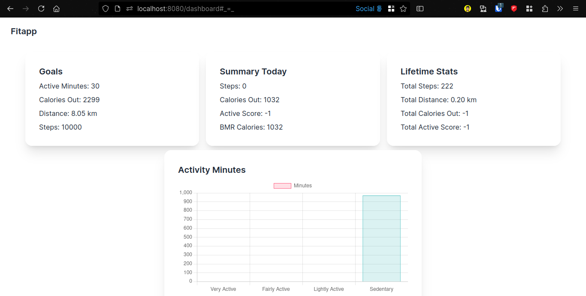
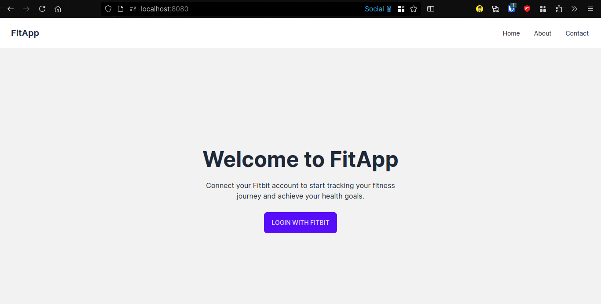
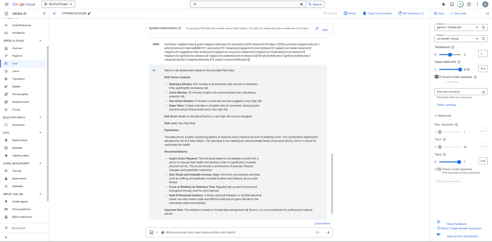

# FitApp - WEARABLES AGGREGATOR AND ANALYZER FOR FAMILY

## Screenshots

## Description

Fitbit, Google Fit, Apple Health, Strava etc.… What if  there is a way to aggregate the data from all these ?
What if there is a centralized platform where all fitness data or the family can be Visualized? 
What if there is a platform that can infer meaning to this data and provide recommendations and email notifications on emergency?

In the current age where the majority of the population is following a very unhealthy lifestyle, the need for a health level sensing app is imminent. Irregular sleeping patterns, abundance of junk food, adoption of work from home culture all have forced us humans to walk less, eat more and hence fall into a loop of unhealthy living. Here a wearable health band can make a difference. With the data it collects from us we can alert them on health issues they are going to face if they continue to live the same way. For example, suppose the health band records the heartbeat of a person and see some major variations in it. It can help in alerting the user about a possible heart attack or any other diseases.

## OUR INNOVATION :
1) Aggregating all the  health data from various wearables like bands , watches agnostic to the brands.
2) Onboard family members and visualize their health data.
3) Analyzes all the health data and provides early warnings and recommendations to people in risk of any diseases , possible heart attack etc.
4) Send these warnings to the people in the favorites list of the target person via notifications.
5) Integration with google home and Alexa so as to announce emergency alerts
6) Provide these APIs to external agency to gather data 
7) Provide developer access to our APIs for 3rd parties to access the aggregated data. (can be a good revenue model)

## TECHNOLOGIES USED :
1) Front end - HTML, CSS, JAVASCRIPT, DAISY UI
2) Back end - Golang, PostgreSQL/ InfluxDB (for time series data), Redis, Webhook
3) ML model, Google vertex AI

## Run project
- Install golang
- do `cd app`
- `go mod tidy`
- `go run .`

